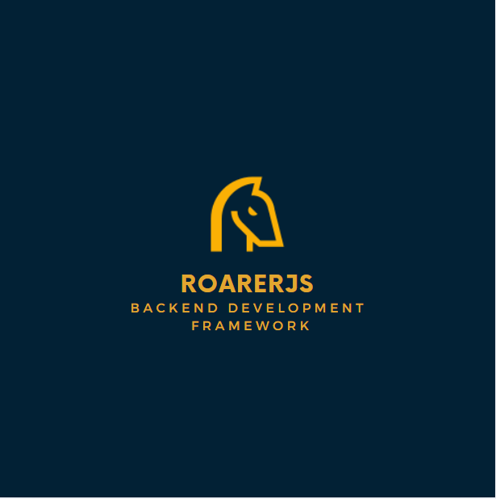

# RoarerJS

- The First Sri Lankan Backend Development Framework (for NodeJS)

RoarerJS is a lightweight and powerful Node.js web framework built for simplicity, clarity, and control.  
It offers a clean structure for building modern RESTful APIs and web applications without unnecessary complexity.

---

## 🚀 Features

- 🧠 Simple, beginner-friendly API
- ⚡ Lightweight core using Node.js `http` module
- 🛣️ Basic routing with `GET` method (more coming soon)
- 🧩 Designed to be modular and extendable
- 🔥 Perfect for learning how backend frameworks work under the hood

---